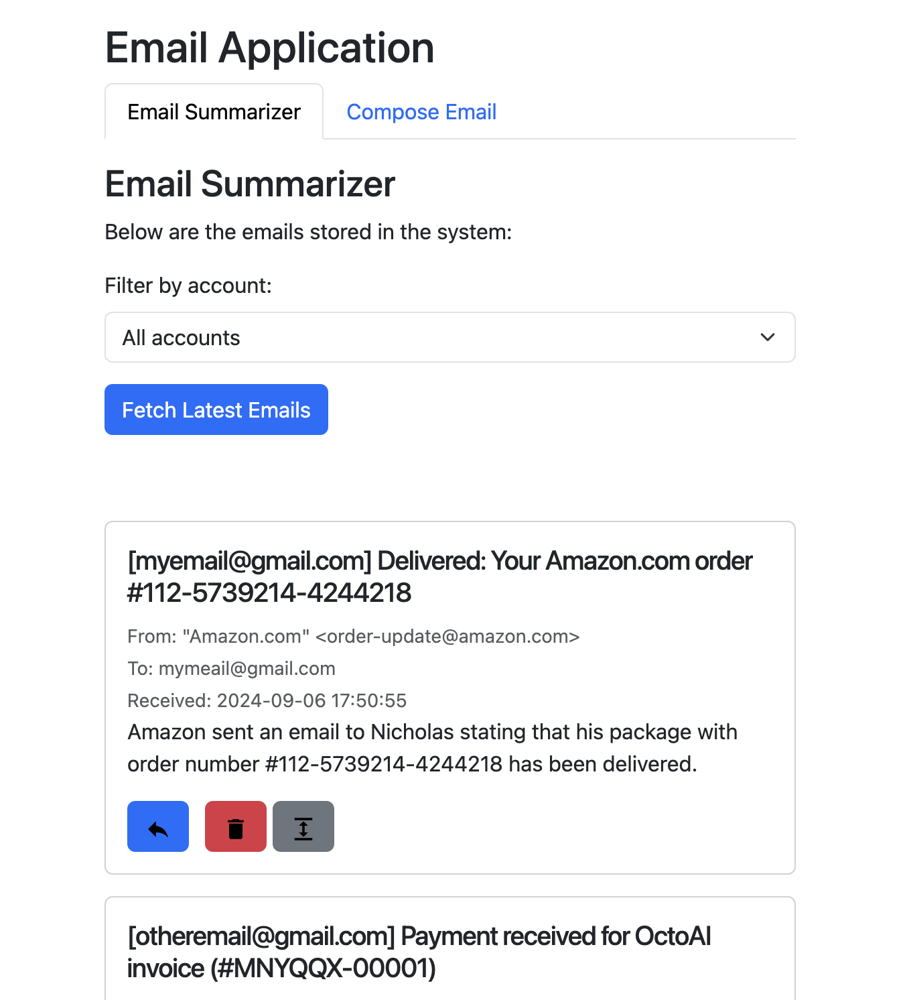
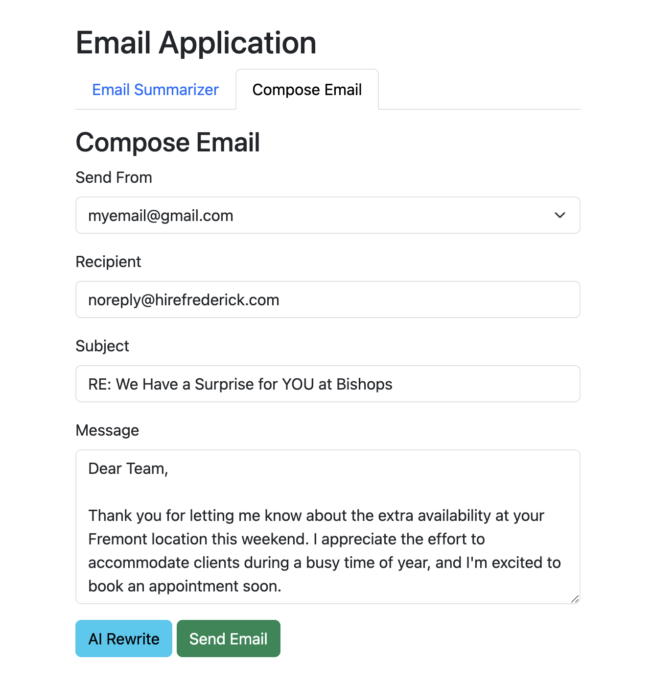

# Email Summarizer and Responder App

This Flask-based web application allows users to fetch emails, summarize their content using a Language Learning Model (LLM), and respond to them directly from the interface. The application also supports additional features such as email deletion, displaying the original email content, and providing the ability to unsubscribe from emails when the option is available.<br>


## Features

1. **Email Summarization**:
    - Fetch the last 10 emails from configured email accounts.
    - Summarize email content using a language model API.
    - Display summaries with relevant details such as sender, subject, and received date.

2. **Respond to Emails**:
    - AI-powered message rewriting is triggered when the "Respond" button is clicked.
    - Pre-fill the compose email form with a polite, contextual response.
    - Auto-selects the "From" email based on which email account received the original email.

3. **Delete Emails**:
    - Delete emails directly from Gmail via the dashboard.
    - One-click "Delete" icon to remove the email from Gmail inbox and UI.

4. **Show Original Email**:
    - Expand to view the full original email content.

5. **Unsubscribe from Emails**:
    - Detects unsubscribe links in emails and displays an unsubscribe button.
    - Clicking the "Unsubscribe" button opens the unsubscribe page in a new tab.

## How It Works

### Backend

- **Flask**: Backend framework handling routing, email fetch, summarization, rewriting, and sending emails.
- **IMAP Integration**: Uses Gmail's IMAP API to fetch and delete emails.
- **LLM Summarization**: An external LLM API is used to summarize emails.
- **LLM Response Generation**: AI-powered responses are generated when replying to emails.
- **Send Email**: Send replies or new emails via Gmail's SMTP service.

### Frontend

- **HTML/CSS**: Uses Bootstrap for styling and responsiveness.
- **JavaScript (jQuery)**: AJAX requests are used to dynamically load and send data between the frontend and backend.
- **SVG Icons**: Custom icons for reply, delete, unsubscribe, and expand email actions are served from the app's `static/icons` folder.

## Application Flow

1. **Dashboard**:
    - Displays the most recent 10 emails fetched from Gmail.
    - Shows sender, subject, received date, and LLM-generated summaries.
    - Includes actions:
        - **Respond**: AI-generated message rewriting for email replies.
        - **Delete**: Deletes the selected email from Gmail.
        - **Show Original Email**: Expands to display the full original email content.
        - **Unsubscribe**: Provides an option to unsubscribe from emails with an unsubscribe link.

2. **Email Summarization**:
    - Fetches emails using Gmail's IMAP API and summarizes them with an external LLM API.
    - Summaries are saved in `summaries.json` and displayed on the frontend.

3. **Compose Email**:
    - Pre-fill the compose form with AI-generated replies or draft new emails.
    - The "Reply" button automatically fills in the recipient, subject, and response using LLM.

4. **Rewrite Email**:
    - Rewrites email responses in a formal tone using LLM.
    - The rewritten message is pre-filled into the Compose Email form.

## File Structure
email-flask-app/<br>
├── static/                      # Static assets like CSS and images<br>
│   ├── icons/                   # Custom SVG icons
│   │   ├── expand.svg
│   │   ├── unsubscribe.svg
│   │   ├── delete.svg
│   │   └── reply.svg
│   └── css/                     # Custom CSS files (if any)
│
├── templates/                   # HTML templates
│   └── index.html               # Main page template
│
├── email_service.py             # Handles email fetching and deletion via IMAP
├── summarizer.py                # Summarizes email content using LLM API
├── rewriteMessage.py            # Handles AI-powered message rewriting
├── emails.js                    # JavaScript logic for email interaction
├── app.py                       # Flask backend and routing
├── utils.py                     # Utility functions (e.g., text cleaning)
└── summaries.json               # JSON file storing fetched email summaries
## Installation

### Prerequisites

- Python 3.x
- Gmail account with "Less secure app access" enabled.
- LLM API endpoint for email summarization and rewriting.

### Setup

1. **Clone the repository**:
    ```bash
    git clone https://github.com/your-repo/email-flask-app.git
    cd email-flask-app
    ```

2. **Install dependencies**:
    ```bash
    pip install -r requirements.txt
    ```

3. **Set up email credentials**:
    Create a file `email_credentials.json` in the project root with the following structure:
    ```json
    {
      "emails": [
        {
          "email": "your-email@gmail.com",
          "password": "your-app-password"
        }
      ]
    }
    ```

4. **Run the app**:
    ```bash
    python app.py
    ```
    The app will run on `http://127.0.0.1:5001`.

## Usage

1. **Visit** `http://127.0.0.1:5001` in your browser.
2. **View the dashboard**: See your summarized emails.
3. **Icons for Actions**:
   - **Reply**: Respond to an email using AI-generated responses.
   - **Delete**: Remove the email from Gmail.
   - **Show Original Email**: View the full content of the email.
   - **Unsubscribe**: Click on the unsubscribe link (if available).
4. **Compose Email**: Draft or respond to emails with the Compose Email form.
## How to Get a Google App Password

To use this application, you'll need to generate an app-specific password for your Google account. This password allows the application to access your email via IMAP while keeping your Google account secure. Follow the steps below:

### Step 1: Enable Two-Factor Authentication (2FA)
App passwords are only available for accounts with 2FA enabled.

1. Go to [Google Account Security](https://myaccount.google.com/security).
2. Scroll down to the **Signing in to Google** section.
3. Ensure **2-Step Verification** is **On**. If it's not, click **2-Step Verification** and follow the instructions to set it up.

### Step 2: Generate an App Password
Once 2FA is enabled:

1. Go to the [Google App Passwords page](https://myaccount.google.com/apppasswords).
2. Select **Mail** as the app, and choose **Other** or **Custom** for the device.
3. Name the custom device something like **Email Summarizer** or **Flask App**.
4. Click **Generate**.
5. Copy the 16-character app password that is shown on the screen.

### Step 3: Use the App Password
1. Add the app password to the `email_credentials.json` file under the `"password"` field for the corresponding email account.
2. Save the file, and you are ready to use the app.

> **Note**: App passwords are case-sensitive. Ensure that you copy and paste it exactly as shown.
## Future Enhancements

- **Multi-account support**: Extend the app to support multiple accounts dynamically.
- **Additional AI functionalities**: Customize tones and formats for AI-generated responses.
- **Better error handling**: Improve error handling for network issues, API errors, and IMAP-related issues.

## License

This project is licensed under the MIT License. See the [LICENSE](LICENSE) file for more details.
